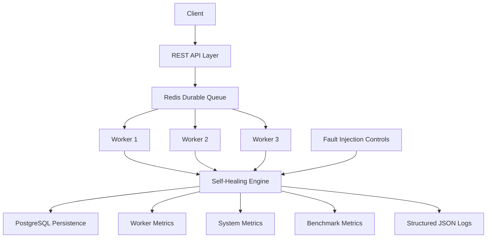

# System Architecture

```mermaid
flowchart TD

    A[Client] --> B[REST API Layer]

    B --> C[Redis Durable Queue]

    C --> D[Worker 1]
    C --> E[Worker 2]
    C --> F[Worker 3]

    D --> G[Self-Healing Engine]
    E --> G
    F --> G

    G --> H[PostgreSQL Persistence]

    G --> I[Worker Metrics]
    G --> J[System Metrics]
    G --> K[Benchmark Metrics]
    G --> L[Structured JSON Logs]

    M[Fault Injection Controls] --> G
```